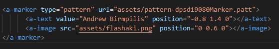
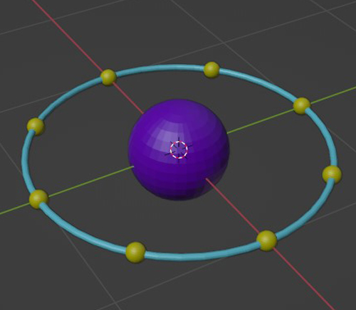
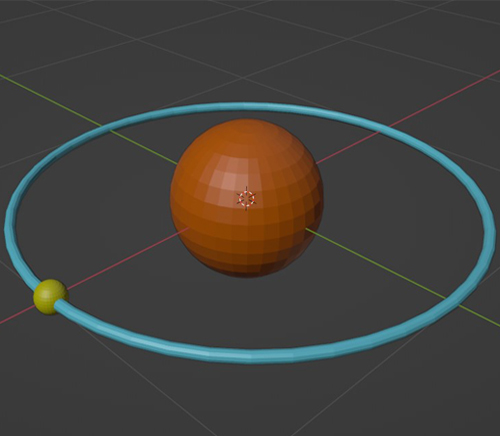
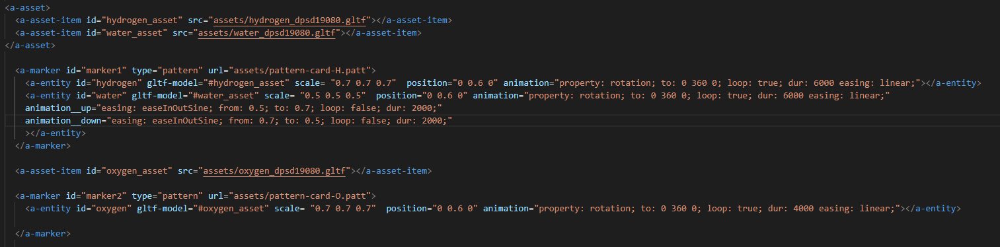
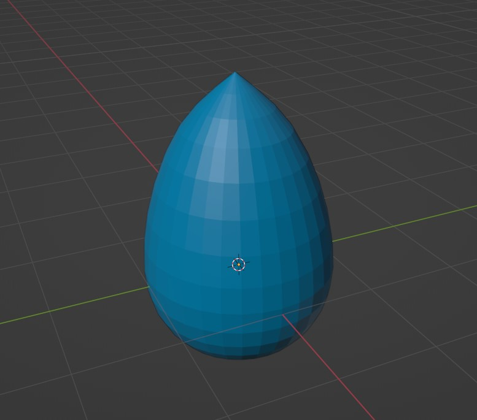
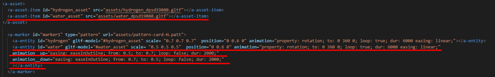
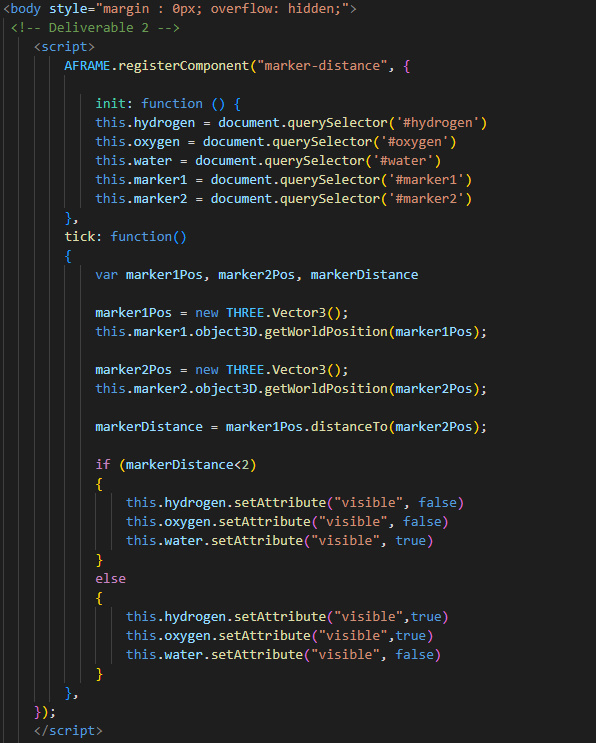
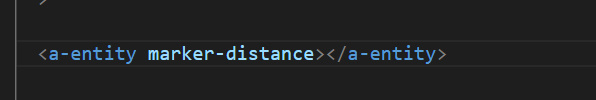

# Lesson: Interaction Design

### First and Last Name: Ανδρέας Μπιρμπίλης | Andreas Birmpilis
### University Registration Number: dpsd19080
### GitHub Personal Profile: [URL](https://github.com/dpsd19080)
### Augmented Reality Personal Repository: [URL](https://github.com/dpsd19080/Augmented-Reality)

# Introduction

# Summary

# 1st Deliverable
Ξεκίνησα την εργασία κατεβάζοντας τα αρχεία από το GitHub. Στην συνέχεια, μελέτησα τα resources που αφορούσαν το πρώτο παραδοτέο και ξεκίνησα την επεξεργασία του κώδικα. Αρχικά, "έπαιξα" με τις διαστάσεις, τα possitions και τις φωνητικές εντολές με σκοπό να τα κατανοήσω καλύτερα. Έπειτα από αρκετούς πειραματισμούς, μου ήρθε η ιδέα να φτιάξω κάτι συγκεκριμένο με τα σχήματα που ζητούσε η εργασία και να μην μείνω απλώς στην τοποθέτηση τους στον χώρο. Τελικά, κατέληξα στο να φτιάξω ένα skate με τα σχήματα. Για την σανίδα χρησιμοποίησα ένα box, για κάθε truck ξεχωριστά χρησιμοποίησα τέσσερα box, δύο κυλίνδρους και για τα ροδάκια τέσσερίς σφαίρες. Τέλος, για την διευκόλυνση του χρήστη, πρόσθεσα ένα text που λέει τις φωνητικές εντολές που πρέπει να πει για να εμφανίσει / εξαφανίσει το χιόνι αντίστοιχα.   

# 2nd Deliverable
Σε αυτό το παραδοτέο ξεκίνησα μελετώντας ξανά τα αντίστοιχα resources. Αρχικά, έφτιαξα στο Photoshop το png για το dpsd μου και με την βοήθεια του [AR.js Marker Training](https://jeromeetienne.github.io/AR.js/three.js/examples/marker-training/examples/generator.html) δημιούργησα τα markers και .patt αρχεία για το dpsd και τα oxygen, hydrogen (που υπήρχαν ήδη σαν png στον φάκελο assets). Έπειτα, αφού τοποθέτησα όλα τα markers και .patt αρχεία στον φάκελο assets ξεκίνησα την υλοποίηση του κώδικα.

Με σκoπό να αναγνωρίζει το marker για το dpsd, δημιούργησα το εξής "a-marker":  
 ㅤㅤㅤㅤㅤㅤㅤㅤㅤㅤㅤㅤㅤㅤㅤㅤㅤㅤㅤㅤㅤㅤㅤㅤㅤㅤㅤㅤ
Ο σκοπός ήταν να εμφανίζεται το όνομα μου και μια εικόνα από κάτω. Αυτό επιτεύχθηκε με το "a-text" και "a-image" αντίστοιχα.

Το επόμενο βήμα ήταν να ασχοληθώ με την αναγνώριση των markers του Oxygen και του Hydrogen.
Αρχικά, δημιούργησα 3D μοντέλα για το Oxygen και το Hydrogen στο Blender:

  
Στην συνέχεια, δημιούργησα "a-asset-item","a-marker" και "a-entity" για το κάθε ένα και φρόντισα να βάλω σωστά τα ονόματα των αρχείων και των id ώστε να εμφανίζονται: 
 ㅤ
 #### Σημείωση 1: Έχουν δημιουργηθεί αντίστοιχα "a-asset-item" και "a-entity" για το νερό. Αλλά θα αναφερθώ αναλυτικότερα σε αυτό αργότερα, στο πως υλοποiήσησα το distance.
 #### Σημείωση 2: Τα animations πραγματοποιήθηκαν ύστερα από μελέτη του [Animation – A-Frame](https://aframe.io/docs/1.3.0/components/animation.html) και [A-FRAME | How To Do Web VR Animations](https://www.youtube.com/watch?v=ZGk5XlPscsk&t=482s). Πιο συγκεκριμένα, από το site βρήκα πως να κάνω το rotation και από το βίντεο προσπάθησα να κάνω το νερό να ανεβοκατεβαίνει
 
Για να ολοκληρώσω το παραδοτέο, έμενε με την βοήθεια της JavaScript να υπολογίζεται η απόσταση των δύο markers έτσι ώστε όταν έρχονται κοντά μεταξύ τους να εμφανίζεται το νερό. Το πρώτο βήμα, όπως ανέφερα και στην πρώτη σημείωση, ήταν η δημιουργία 3D μοντέλου, "a-asset-item" και "a-entity" για το νερό:
 
  (Τα υπογραμμισμένα είναι αυτά που αφορούν το νερό)
 
 Σημαντικό είναι να αναφερθεί, πως τοποθέτησα το "a-entiry" μέσα στον marker του Hydrogen επειδή το παραδοτέο δεν απαιτούσε κάποιο ξεχωριστό marker για το νερό. Ο σκοπός ήταν όταν έρχονται τα markers κοντά να εμφανίζεται σε ένα από τα δύο ήδη υπάρχοντα. 
 
 Το τελευταίο και πιο πολύπλοκο βήμα, ήταν ο υπολογισμός της απόστασης και η εμφάνιση του νερού. Αρχικά, συμβουλεύτηκα το [How to get marker position (x,y) AR.js](https://stackoverflow.com/questions/61239107/how-to-get-marker-position-x-y-ar-js?fbclid=IwAR1Sn5znFMi_lntPM_S7T3aLX5rdjE2Fj5HIk7CQtOUiaG6ZdR-dc5mFcss) για να καταλάβω πως και τι πρέπει να γράψω. Επειδή δεν αρκούσε μονάχα αυτό για να βγάλω άκρη, άρχισα να ψάχνω περισσότερα πράγματα στο Google για την λογική της JavaScript. Ύστερα από κάμποσο ψάξιμο βρήκα κάποια παρόμοια παραδείγματα στο GitHub: [AR.js-examples](https://github.com/stemkoski/AR.js-examples), τα οποία μελέτησα και με βοήθησαν αρκετά στην κατανόηση της λογικής. Έχοντας πλέον κατανοήσει τα βασικά, κατάφερα να καταλήξω στο παρακάτω:
 
 
Η λογική είναι η εξής: Έχω φτιάξει τρεις μεταβλητές, marker1Pos, marker2Pos και markerDIstance. Οι πρώτες δύο (marker1Pos και marker2Pos) αφορούν την τοποθεσία του πρώτου και δεύτερου marker αντίστοιχα. Η μεταβλητή markerDIstance είναι για την απόσταση μεταξύ των δύο markers. Οι επόμενες εντολές, κάτω από τις μεταβλητές και πάνω από το if, "παίρνουν" τα Position των markers και υπολογίζουν την απόσταση μεταξύ τους. Η markerDistace γίνεται ίση με την τιμή της απόστασης, αν είναι μικρότερη από 2 τότε εξαφανίζονται τα Oxygen και Hydrogen και εμφανίζεται το Water.
Τέλος, κάλεσα τo script στην html για να δουλεύει.
 

# 3rd Deliverable 

# Conclusions

# Sources
#### 1st Deliverable:
- [Α-Frame School](https://aframe.io/aframe-school/#/)
- [Α-Frame particle system component](https://www.npmjs.com/package/aframe-particle-system-component)
- [Α-Frame speech command component](https://www.npmjs.com/package/aframe-speech-command-component)

#### 2st Deliverable:
- [AR.js Marker Training](https://jeromeetienne.github.io/AR.js/three.js/examples/marker-training/examples/generator.html)
- [Animation – A-Frame](https://aframe.io/docs/1.3.0/components/animation.html)
- [A-FRAME | How To Do Web VR Animations](https://www.youtube.com/watch?v=ZGk5XlPscsk&t=482s)
- [How to get marker position (x,y) AR.js](https://stackoverflow.com/questions/61239107/how-to-get-marker-position-x-y-ar-js?fbclid=IwAR1Sn5znFMi_lntPM_S7T3aLX5rdjE2Fj5HIk7CQtOUiaG6ZdR-dc5mFcss)
- [AR.js-examples](https://github.com/stemkoski/AR.js-examples)
