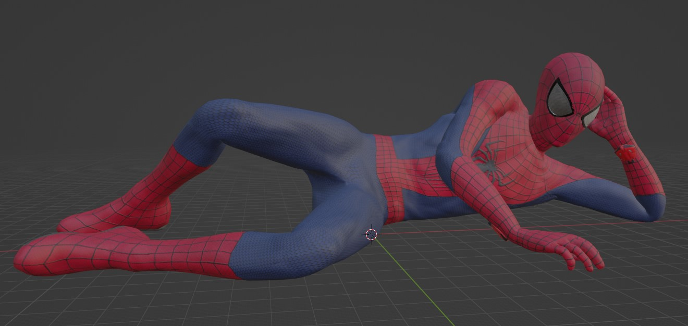
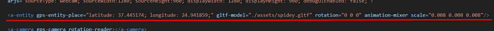
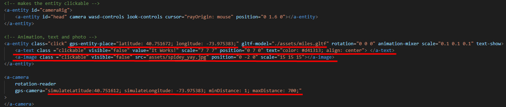
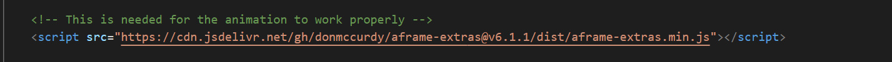
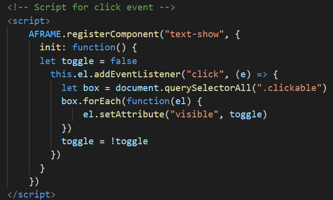
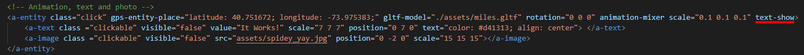

# Lesson: Interaction Design

### First and Last Name: Ανδρέας Μπιρμπίλης | Andreas Birmpilis
### University Registration Number: dpsd19080
### GitHub Personal Profile: [URL](https://github.com/dpsd19080)
### Augmented Reality Personal Repository: [URL](https://github.com/dpsd19080/Augmented-Reality)

# Introduction
Στα πλαίσια του μαθήματος "Διακρατική Σχεδίαση" καλούμε να υλοποιήσω μια ατομική εργασία με θέμα την επαυξημένη πραγματικότητα, η οποία αντιστοιχεί στο 50% του τελικού μου βαθμού. 
# Summary
Η ατομική εργασία χωρίζεται σε τρία παραδοτέα: 
#### 1st Deliverable:
#### 2st Deliverable:
#### 3st Deliverable:

# 1st Deliverable
Ξεκίνησα την εργασία κατεβάζοντας τα αρχεία από το GitHub. Στην συνέχεια, μελέτησα τα resources που αφορούσαν το πρώτο παραδοτέο και ξεκίνησα την επεξεργασία του κώδικα. Αρχικά, "έπαιξα" με τις διαστάσεις, τα possitions και τις φωνητικές εντολές με σκοπό να τα κατανοήσω καλύτερα. Έπειτα από αρκετούς πειραματισμούς, μου ήρθε η ιδέα να φτιάξω κάτι συγκεκριμένο με τα σχήματα που ζητούσε η εργασία και να μην μείνω απλώς στην τοποθέτηση τους στον χώρο. Τελικά, κατέληξα στο να φτιάξω ένα skate με τα σχήματα. Για την σανίδα χρησιμοποίησα ένα box, για κάθε truck ξεχωριστά χρησιμοποίησα τέσσερα box, δύο κυλίνδρους και για τα ροδάκια τέσσερίς σφαίρες. Τέλος, για την διευκόλυνση του χρήστη, πρόσθεσα ένα text που λέει τις φωνητικές εντολές που πρέπει να πει για να εμφανίσει / εξαφανίσει το χιόνι αντίστοιχα.   

# 2nd Deliverable
Σε αυτό το παραδοτέο ξεκίνησα μελετώντας ξανά τα αντίστοιχα resources. Αρχικά, έφτιαξα στο Photoshop το png για το dpsd μου και με την βοήθεια του [AR.js Marker Training](https://jeromeetienne.github.io/AR.js/three.js/examples/marker-training/examples/generator.html) δημιούργησα τα markers και .patt αρχεία για το dpsd και τα oxygen, hydrogen (που υπήρχαν ήδη σαν png στον φάκελο assets). Έπειτα, αφού τοποθέτησα όλα τα markers και .patt αρχεία στον φάκελο assets ξεκίνησα την υλοποίηση του κώδικα.

Με σκoπό να αναγνωρίζει το marker για το dpsd, δημιούργησα το εξής "a-marker":  
 ㅤㅤㅤㅤㅤㅤㅤㅤㅤㅤㅤㅤㅤㅤㅤㅤㅤㅤㅤㅤㅤㅤㅤㅤㅤㅤㅤㅤ
Ο σκοπός ήταν να εμφανίζεται το όνομα μου και μια εικόνα από κάτω. Αυτό επιτεύχθηκε με το "a-text" και "a-image" αντίστοιχα.

Το επόμενο βήμα ήταν να ασχοληθώ με την αναγνώριση των markers του Oxygen και του Hydrogen.
Αρχικά, δημιούργησα 3D μοντέλα για το Oxygen και το Hydrogen στο Blender:

  
Στην συνέχεια, δημιούργησα "a-asset-item","a-marker" και "a-entity" για το κάθε ένα και φρόντισα να βάλω σωστά τα ονόματα των αρχείων και των id ώστε να εμφανίζονται: 
 ㅤ
 #### Σημείωση 1: Έχουν δημιουργηθεί αντίστοιχα "a-asset-item" και "a-entity" για το νερό. Αλλά θα αναφερθώ αναλυτικότερα σε αυτό αργότερα, στο πως υλοποiήσησα το distance.
 #### Σημείωση 2: Τα animations πραγματοποιήθηκαν ύστερα από μελέτη του [Animation – A-Frame](https://aframe.io/docs/1.3.0/components/animation.html) και [A-FRAME | How To Do Web VR Animations](https://www.youtube.com/watch?v=ZGk5XlPscsk&t=482s). Πιο συγκεκριμένα, από το site βρήκα πως να κάνω το rotation και από το βίντεο προσπάθησα να κάνω το νερό να ανεβοκατεβαίνει
 
Για να ολοκληρώσω το παραδοτέο, έμενε με την βοήθεια της JavaScript να υπολογίζεται η απόσταση των δύο markers έτσι ώστε όταν έρχονται κοντά μεταξύ τους να εμφανίζεται το νερό. Το πρώτο βήμα, όπως ανέφερα και στην πρώτη σημείωση, ήταν η δημιουργία 3D μοντέλου, "a-asset-item" και "a-entity" για το νερό:
 
  (Τα υπογραμμισμένα είναι αυτά που αφορούν το νερό)
 
 Σημαντικό είναι να αναφερθεί, πως τοποθέτησα το "a-entiry" μέσα στον marker του Hydrogen επειδή το παραδοτέο δεν απαιτούσε κάποιο ξεχωριστό marker για το νερό. Ο σκοπός ήταν όταν έρχονται τα markers κοντά να εμφανίζεται σε ένα από τα δύο ήδη υπάρχοντα. 
 
 Το τελευταίο και πιο πολύπλοκο βήμα, ήταν ο υπολογισμός της απόστασης και η εμφάνιση του νερού. Αρχικά, συμβουλεύτηκα το [How to get marker position (x,y) AR.js](https://stackoverflow.com/questions/61239107/how-to-get-marker-position-x-y-ar-js?fbclid=IwAR1Sn5znFMi_lntPM_S7T3aLX5rdjE2Fj5HIk7CQtOUiaG6ZdR-dc5mFcss) για να καταλάβω πως και τι πρέπει να γράψω. Επειδή δεν αρκούσε μονάχα αυτό για να βγάλω άκρη, άρχισα να ψάχνω περισσότερα πράγματα στο Google για την λογική της JavaScript. Ύστερα από κάμποσο ψάξιμο βρήκα κάποια παρόμοια παραδείγματα στο GitHub: [AR.js-examples](https://github.com/stemkoski/AR.js-examples), τα οποία μελέτησα και με βοήθησαν αρκετά στην κατανόηση της λογικής. Έχοντας πλέον κατανοήσει τα βασικά, κατάφερα να καταλήξω στο παρακάτω:
 
 
Η λογική είναι η εξής: Έχω φτιάξει τρεις μεταβλητές, marker1Pos, marker2Pos και markerDIstance. Οι πρώτες δύο (marker1Pos και marker2Pos) αφορούν την τοποθεσία του πρώτου και δεύτερου marker αντίστοιχα. Η μεταβλητή markerDIstance είναι για την απόσταση μεταξύ των δύο markers. Οι επόμενες εντολές, κάτω από τις μεταβλητές και πάνω από το if, "παίρνουν" τα Position των markers και υπολογίζουν την απόσταση μεταξύ τους. Η markerDistace γίνεται ίση με την τιμή της απόστασης, αν είναι μικρότερη από 2 τότε εξαφανίζονται τα Oxygen και Hydrogen και εμφανίζεται το Water.
Τέλος, κάλεσα τo script στην html για να δουλεύει.
 

# 3rd Deliverable 
Στο τελευταίο παραδοτέο ξεκίνησα να ασχολούμαι πρώτα με το syros.html. Σκοπός ήταν να εμφανίζεται ένα 3D μοντέλο σε συγκεκριμένο γεωγραφικό σημείο της Σύρου. Αρχικά, βρήκα ένα έτοιμο μοντέλο που μου άρεσε στο [Sketchfab](https://sketchfab.com/) και πιο συγκεκριμένα αυτό: [The Amazing Spider Man 2 Rigged Model](https://sketchfab.com/3d-models/the-amazing-spider-man-2-rigged-model-fd9385343d14477a979d0269b3015e1e) Έπειτα, άνοιξα και επεξεργάστηκα το μοντέλο στο Blender με σκοπό να το προσαρμόσω στα δεδομένα της εργασίας (κυρίως να το αποθηκεύσω σε gltf και να φτιάξω λίγο κάποια textures):
 
 Τέλος, αντικατέστησα τις συντεταγμένες και το μοντέλο με αυτά που ήθελα! 
 
 
 Τώρα, για να ολοκληρώσω το παραδοτέο (και επίσημα την ατομική εργασία) έμενε να τροποποιήσω κατάλληλα το index.html ώστε να εμφανίζεται ένα 3D μοντέλο (κατά προτίμηση με animation) και όταν το κλικάρω να εμφανίζει/εξαφανίζει κείμενο. Επιπλέον, έπρεπε να αλλάξω τις συντεταγμένες για το μοντέλο και την κάμερα σε μια μακρινή τοποθεσία.
Όπως και στο syros.html, έτσι και εδώ βρήκα έτοιμο μοντέλο, animation: [Spiderman Blender Animation](https://illusionb3d.gumroad.com/l/ChNfG) και το προσάρμοσα στα δεδομένα της εργασίας. 
Στην συνέχεια, επέλεξα ένα μακρινό γεωγραφικό μέρος ώστε να αλλάξω τις συντεταγμένες στο "a-entity" και "a-camera" αντίστοιχα. Πρόσθεσα επίσης το 3D μοντέλο που βρήκα μαζί με το animation, το κείμενο και μία εικόνα.
 

#### Σημείωση 1: Στο Screenshot, το "a-entity" με id "cameraRig" έχει δημιουργηθεί με σκοπό το entity να είναι clickable. Κάτι που βοηθά στο κομμάτι της εργασίας που αφορά το να κλικάρω για να εμφανίζει/εξαφανίζει κείμενο κλπ. 

#### Σημείωση 2: Επιπλέον, μπορούμε να δούμε πως στα "a-entity", "a-text" και "a-image" (που αφορούν το Animartion, text και image) υπάρχουν classes με όνομα "click" και "clickable". Βρίσκονται εκεί επειδή "συνδέονται" με το script που είναι υπεύθυνο για το click event. Θα μιλήσω αναλυτικότερα για αυτό το script παρακάτω. 

#### Σημείωση 3: Το animation είναι φτιαγμένο με το Blender. Για να δουλέψει χρειάστηκε το συγκεκριμένο script, το οποίο παρατήρησα πως χρησιμοποιείται εδώ: [A-frame pause/play animation mixer](https://stackoverflow.com/questions/70735151/a-frame-pause-play-animation-mixer)
 

Έχοντας πλέον έτοιμο το μοντέλο, το κείμενο και την εικόνα, έμενε να γράψω το script για το click event. Δηλαδή, όταν κλικάρω πάνω στο μοντέλο να εμφανίζεται/εξαφανίζεται το κείμενο και η εικόνα. Αυτό το κατάφερα ύστερα από μελέτη του κώδικα του [salty-partner-1](https://glitch.com/~salty-partner-1) 
 
 
 Τέλος, το μόνο που έμενε να κάνω ήταν να καλέσω το script στην html για να είναι όντως clickable το μοντέλο και να εμφανίζονται το text και image. 
 
 
Και κάπως έτσι, το παραδοτέο ολοκληρώθηκε και πλέον μπορώ να απολαύσω το τελικό αποτέλεσμα!
  
 
 

# Conclusions
Σε αυτή την εργασία ασχολήθηκα με διάφορα πράγματα που είτε δεν είχα ξανά ασχοληθεί, είτε ήθελα πάντοτε αλλά ποτέ δεν μου δόθηκε η ευκαιρία. Έβρισκα πάντα ενδιαφέρουσα την επαυξημένη πραγματικότητα και είχα περιέργεια να δω πως λειτουργεί. Σε αυτό το Project, μέσα από τα παραδοτέα, άρχισα σιγά σιγά και να καταλαβαίνω την λογική αλλά και πως δεν είναι κάτι απίθανο να γίνει αν ψάξεις και πειραματιστείς. Με αρκετό trial and error, κατάφερα να κατανοήσω λίγο την λογική και την χρήση της JavaScript που ούτως ή άλλως αποτελούσε μεγάλο κομμάτι της εργασίας (κυρίως στο δεύτερο και τρίτο παραδοτέο, που έπρεπε να γράψω scripts). Με βοήθησαν ιδιαίτερα κάποια από τα resources που είχαν υποδειχθεί και μέσα από αυτά κατάφερα να βρω και άλλα παρεμφερή ώστε να ολοκληρώσω τα παραδοτέα!
Γενικότερα, μέσα από αυτή την εργασία δεν έμαθα μονάχα κάποια βασικά της JavaScript και επιπρόσθετες γνώσεις για την HTML, άλλα μου δόθηκε η ευκαιρία να μάθω να ψάχνω ορθότερα και πως με λίγη επιμονή και υπομονή πάντα μπορώ να βρω άκρη και να οδηγηθώ στην λύση. 

# Sources
#### 1st Deliverable:
- [Α-Frame School](https://aframe.io/aframe-school/#/)
- [Α-Frame particle system component](https://www.npmjs.com/package/aframe-particle-system-component)
- [Α-Frame speech command component](https://www.npmjs.com/package/aframe-speech-command-component)

#### 2st Deliverable:
- [AR.js Marker Training](https://jeromeetienne.github.io/AR.js/three.js/examples/marker-training/examples/generator.html)
- [Animation – A-Frame](https://aframe.io/docs/1.3.0/components/animation.html)
- [A-FRAME | How To Do Web VR Animations](https://www.youtube.com/watch?v=ZGk5XlPscsk&t=482s)
- [How to get marker position (x,y) AR.js](https://stackoverflow.com/questions/61239107/how-to-get-marker-position-x-y-ar-js?fbclid=IwAR1Sn5znFMi_lntPM_S7T3aLX5rdjE2Fj5HIk7CQtOUiaG6ZdR-dc5mFcss)
- [AR.js-examples](https://github.com/stemkoski/AR.js-examples)

#### 3st Deliverable:
- [Sketchfab](https://sketchfab.com/)
- [The Amazing Spider Man 2 Rigged Model](https://sketchfab.com/3d-models/the-amazing-spider-man-2-rigged-model-fd9385343d14477a979d0269b3015e1e)
- [Spiderman Blender Animation](https://illusionb3d.gumroad.com/l/ChNfG)
- [A-frame pause/play animation mixer](https://stackoverflow.com/questions/70735151/a-frame-pause-play-animation-mixer)
- [salty-partner-1](https://glitch.com/~salty-partner-1) 
 
